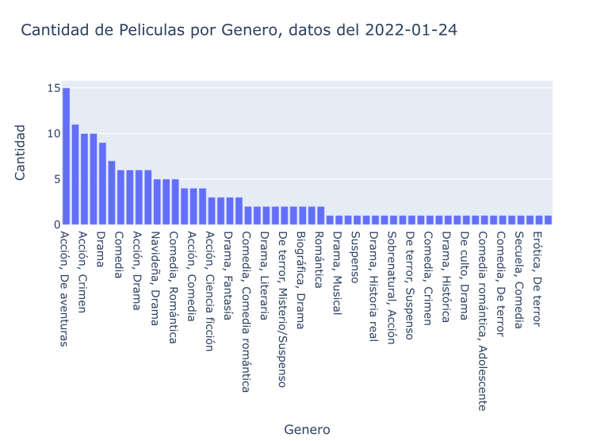
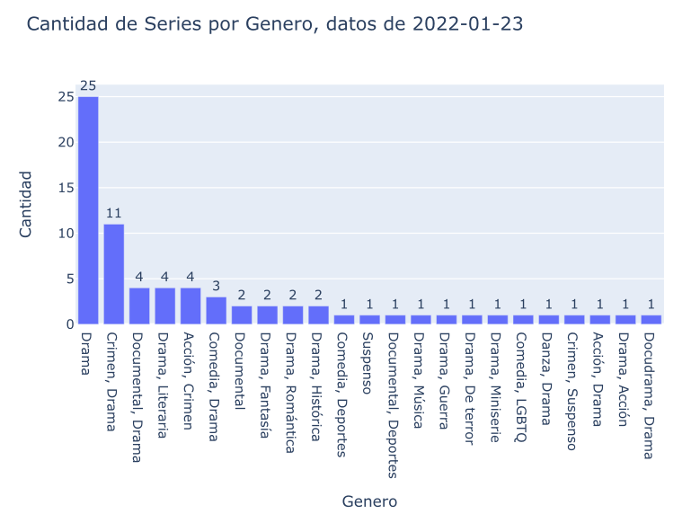

<div>

</div>

```{r setup, include=FALSE}
knitr::opts_chunk$set(echo = FALSE)
```

```{css my-header-colors, echo = FALSE}
.distill-site-nav {
    color: white;
    background-image: url('https://i.gifer.com/WGkW.gif');
    border: solid 1px black;
    border-radius: .3rem;
    font-size: 15px;
    font-weight: 300;
    background-size: cover;
    background-position: 100%;

}


```


# Web Scraping starz


<p align="center">

</p>


<b>Starzplay</b> es un servicio <b>streaming</b> que ofrece un catálogo de producciones propias del canal de televisión por cable estadounidense Starz, propiedad de Starz Entertainment. Cuenta también con películas, series y documentales del resto de propiedades de Starz, así como de otros estudios internacionales.

El <b>streaming</b> es una tecnología que causo un antes y un después en la industria del entretenimiento y cambio para siempre nuestra forma de consumir contenido. Consiste en permitir acceder a un archivo multimedia al mismo tiempo que se está descargando, este archivo no termina ocupando lugar en nuestra memoria ya que se guarda parcialmente en una parte llamada buffer que funciona como una especie de memoria de corto plazo que almacena los datos durante el consumo y luego los elimina. Ya no se necesita esperar un horario determinado para disfrutar de una serie o una película, sino que, todo lo contrario, podemos planificar nuestro tiempo para hacerlo cuando tengamos ganas. El streaming nos ha traído independencia, no estamos obligados a depender de los rígidos horarios de los canales tradicionales. 

Existen muchas plataformas de streaming que compiten para captar nuestra atención. la gran mayoría de ellas recopilas nuestra información de como interactuamos con la plataforma para mejorar el servicio.

Starz cuenta con un modelo de negocio donde la retención de suscriptores se vuelve tan importante, si no más, como la adquisición de suscriptores en primer lugar. La pieza central de la estrategia de retención de suscriptores de transmisión de Starz es su biblioteca de programas y películas.

El siguiente trabajo consistió en hacer Web Scraping en la página de starz, capturar todas las películas, todas las series con sus temporadas y capítulos y guardar los datos más relevantes de cada uno en formato <b><span style = "color:#e5f048">.json</span></b> .

Una vez terminado el Web Scraping se guardan los archivos <b><span style = "color:#e5f048">.json</span></b> , se hace un gráfico de barras para las películas y series para visualizar los géneros de cada una y por último se ejecuta un comando para insertar los datos a <b><span style = "color:#58b54c">MongoDB</span></b> .


# Librerias Utilizadas

<ui>

<li>
{BeautifoulSoup}
</li>

<li>
{Selenium}
</li>

<li>
{Pandas}
</li>

<li>
{Plotly}
</li>

</ui>






Codigo en: [GitHub](https://github.com/MGaloto/scrap_starz)

