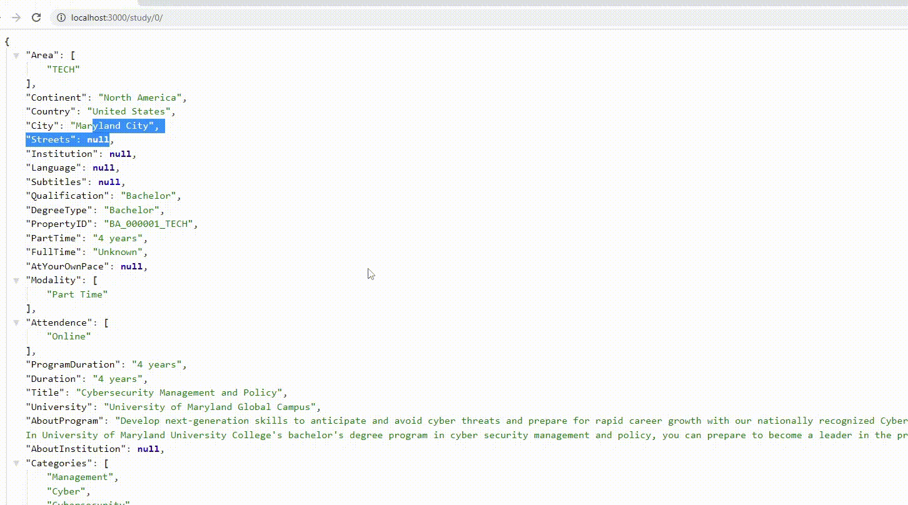

<div >

</div>

```{r setup, include=FALSE}

knitr::opts_chunk$set(echo = FALSE)

```

```{css my-header-colors, echo = FALSE}

.distill-site-nav {
    color: white;
    background-image: url('https://i.gifer.com/WGkW.gif');
    border: solid 1px black;
    border-radius: .3rem;
    font-size: 15px;
    font-weight: 300;
    background-size: cover;
    background-position: 100%;
}

```


<h1 align="center">API</h1>

Una API representa la capacidad de comunicación entre componentes de software. Se trata del conjunto de llamadas a ciertas bibliotecas que ofrecen acceso a ciertos servicios desde los procesos y representa un método para conseguir abstracción en la programación, generalmente (aunque no necesariamente) entre los niveles o capas inferiores y los superiores del software. Uno de los principales propósitos de una API consiste en proporcionar un conjunto de funciones de uso general, por ejemplo, para dibujar ventanas o iconos en la pantalla. De esta forma, los programadores se benefician de las ventajas de las API haciendo uso de su funcionalidad, evitándose el trabajo de programar todo desde el principio. Las API asimismo son abstractas: el software que proporciona una cierta API generalmente es llamado la implementación de esa API.

<p align="center">

</p>


<br>
</br>


<h1 align="center">Web Scraping</h1>


<p align="center">

</p>


<br>
</br>

El siguiente trabajo consiste en el desarrollo de un Pipeline de Datos para automatizar la extraccion, transoformacion y carga de datos de las siguientes paginas:

[Whed](https://whed.net/results_institutions.php)

[Study Portals](https://studyportals.com/)

Una vez finalizado se prueba una *API* en el servidor local para los contenidos obtenidos


Librerias:

<ui>
<li>
Selenium
</li>
<li>
Beautifoulsoup
</li>
<li>
Request
</li>
<li>
Json
</li>
<li>
Flask
</li>
</ui>

<br>
</br>

Ejemplo de un contenido:

```json
{
    "Area": ["TECH"],
    "Pais": "United States",
    "Ciudad": "Newark",
    "Calles": "104 Hullihen Hall",
    "Institucion": "Private",
    "Idioma": "English",
    "Subtitulos": null,
    "Calificacion": "M.Sc.",
    "Nivel": "master",
    "Part Time": "Unknown",
    "Full Time": "1 years",
    "Cursada": ["On Campus"],
    "Duracion": "Unknown",
    "Titulo": "Mechanical Engineering",
    "Universidad": "University of Delaware",
    "Descripcion Programa": "The Department of Mechanical Engineering at the University of Delaware offers graduate programs leading to the degrees of Master of Science in Mechanical Engineering (MSME) and Doctor of Philosophy (PhD) in mechanical engineering. ",
    "Descripcion Universidad": "Founded 1833.",
    "Categoria": ["Engineering","Mechanical Engineering"],
    "Deadline": null,
    "Requerimientos": null,
    "Tutition Free": "26303 EUR / year",
    "Valoracones": null,
    "Link University": "http://www.udel.edu",
    "logo": "//storage-prtl-co.imgix.net/endor/organisations/20014/logos/1607075563_bath-logo.png",
    "Multimedia": null
  }

```

<br>
</br>

<h1 align="center">Final Dashboard</h1>


<ui>
<li>
https://rpubs.com/MGaloto/study_university
</li>
</ui>

<p align="center">
  
</p>

<br>
</br>


<h1 align="center">API</h1>

```python

from flask import Flask, json 

app = Flask(__name__)


'''
degree = {'Bachelor', 'Course', 'Master', 'Phd'}
page   = [0:64834]
'''

@app.route("/<degree>/<page>/")
def Study(degree, page):
    consolidado = json.load(open('Consolidado/consolidado_final.json', encoding='utf-8'))
    consolidado_page = [consolidado[i] for i in range(len(consolidado)) if consolidado[i]['DegreeType'] == str(degree)][int(page)]
    response = app.response_class(response = json.dumps(consolidado_page), status = 200, mimetype = "application/json")
    return response

app.run( port = 3000, host = "0.0.0.0" )

```
<br>
</br>

<p align="center">
  
</p>

<br>
</br>


<h1 align="center">Codigo</h1>

<ui>
<li>
https://github.com/MGaloto/api_university
</li>
</ui>
