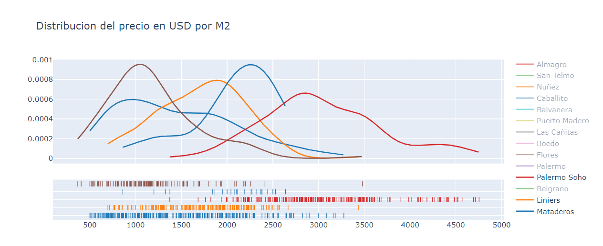

<div >

</div>

```{r setup, include=FALSE}

knitr::opts_chunk$set(echo = FALSE)

```

```{css my-header-colors, echo = FALSE}

.distill-site-nav {
    color: white;
    background-image: url('https://i.gifer.com/WGkW.gif');
    border: solid 1px black;
    border-radius: .3rem;
    font-size: 15px;
    font-weight: 300;
    background-size: cover;
    background-position: 100%;
}

```


### **Regresión Lineal**


El Data Set de la inmobiliaria Properatti contiene observaciones de distintos tipos de propiedades en toda la Argentina, hay varios datos faltantes como también observaciones atípicas.

El trabajo se realizo en Python utilizando Jupyter Notebook y las siguientes librerías:

<ui>

<li>
{Matplotlib}
</li>

<li>
{Seaborn}
</li>

<li>
{Scikit-Learn}
</li>


</ui>


### **3D Plot**


<div>

</div>


### **Distribucion de Precios**

<div>

</div>

Codigo publicado en: [Github](https://github.com/MGaloto/cleandata)

