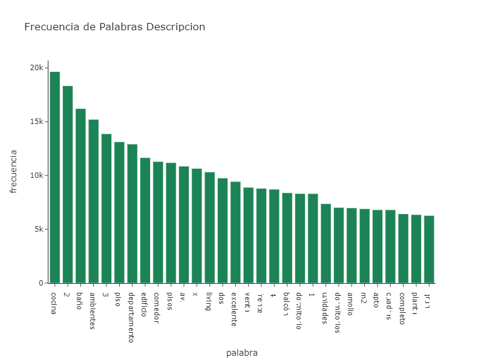

<div >

</div>

```{r setup, include=FALSE}

knitr::opts_chunk$set(echo = FALSE)

```

```{css my-header-colors, echo = FALSE}

.distill-site-nav {
    color: white;
    background-image: url('https://i.gifer.com/WGkW.gif');
    border: solid 1px black;
    border-radius: .3rem;
    font-size: 15px;
    font-weight: 300;
    background-size: cover;
    background-position: 100%;
}

```


# Regresion Lineal Multiple


Las Notebooks presentadas en este proyecto contienen un análisis exploratorio y predictivo sobre el precio en dólares por metro cuadrado de distinto tipo de propiedades. Estos datos provienen de la inmobiliaria Properatti.

Se realizo un profundo análisis sobre valores atípicos utilizando estadística descriptiva y visualización para limpiar los datos ya que el data set cuenta con valores nulos y errores de tipeo. En una de las variables del data set se utilizo la libreria NLTK de procesamiento de lenguaje natual para sacar palabras claves que sumen como features (Las amenities).

El propósito de la limpieza del Data Set es a los efectos de poder estimar un modelo de *regresión lineal* para obtener los estimadores que mejor se ajusten y así predecir los precios en dólares por metro cuadrado.


<p>
<a href="https://scikit-learn.org/stable/" rel="nofollow"></a>
</p>


# Presentacion

El trabajo final se presenta en una Notebook de Jupyter y en dos documentos R Markdown. En uno de ellos se encuentra el Data Wrangling y en el otro el modelo de *regresión lineal*.


# Incluye

<ui>

<li>
Extraccion, Transformacion y Carga de Datos.
</li>

<li>
Limpieza del Data Set
</li>

<li>
Graficos Dinamicos y Estaticos.
</li>

<li>
Regresion Lineal Multiple
</li>

</ui>


# Librerias

<ui>

<li>
{Matplotlib}
</li>

<li>
{Seaborn}
</li>

<li>
{Scikit-Learn}
</li>

<li>
{Plotly}
</li>

<li>
{NLTK}
</li>


</ui>

# Visualizaciones

**3D Plot**

Gráfico en tercera dimensión que relaciona tres variables del data set:

<p align="center">
  
</p>

**NLTK**

Palabras claves para las features obtenidas del uso de la librería NLTK:

<p align="center">
  
</p>


# Datos


[properatti.csv](https://drive.google.com/file/d/1q25gqE943_Rhq9ejUrAVQSC-m3-O6XGF/view?usp=sharing)

# Codigo


[Github](https://github.com/MGaloto/cleandata)

# Dashboards


[Primera Parte](https://rpubs.com/MGaloto/data_wrangling)

[Segunda Parte](https://rpubs.com/MGaloto/regresionLinealMultiple)
