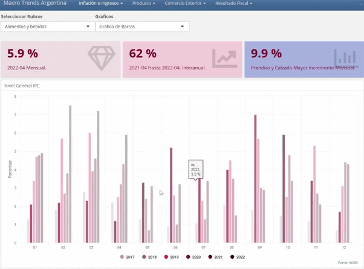

<div >

</div>

```{r setup, include=FALSE}

knitr::opts_chunk$set(echo = FALSE)

```


# Shiny


Shiny es un paquete R que facilita la creación de aplicaciones web interactivas directamente desde R. Puede alojar aplicaciones independientes en una página web o incrustarlas en documentos R Markdown o crear paneles . También puede ampliar sus aplicaciones Shiny con temas CSS , widgets html y acciones de JavaScript .


# Argentina Macro Trends


Proyecto en Curso que consiste en un dashboard dinámico de Variables Macroeconómicas para Argentina usando el Framework Shiny. Este dashboard se alimenta de los datos suministrados por el Indec de forma automática,
El trabajo en primera instancia toma los datos de inflación por rubro para presentarlos en forma estática y dinámica. Se puede interactuar con el dashboard para ver:

<ui>

<li>
Inflación mensual por rubro.
</li>

<li>
Inflación interanual por rubro.
</li>

<li>
Serie Temporal de la inflación interanual por rubro
</li>

</ui>

La siguiente etapa del proyecto es generar gráficos interactivos en donde el usuario va a poder seleccionar variables macroeconómicas en un Scatter Plot y observar la relación de las mismas en valores absolutos y en tasas de cambio.


<p>
<a href="https://pkgs.rstudio.com/flexdashboard/" rel="nofollow"></a>
<a href="https://shiny.rstudio.com/" rel="nofollow"></a>
</p>


# Incluye

<ui>

<li>
Extraccion, Transformacion y Carga.
</li>

<li>
Graficos Dinamicos y Estaticos.
</li>

<li>
Interactividad con Shiny.
</li>


</ui>


# Paquetes de R

<ui>

<li>
{tidyverse}
</li>

<li>
{plotly}
</li>

<li>
{highcharter}
</li>

<li>
{Shiny}
</li>

<li>
{flexdashboard}
</li>

</ui>

# Gif

<p align="center">
  
</p>

# App

<ui>

<li>
https://maxi-galo.shinyapps.io/MacroTrends
</li>


</ui>


# Datos

<ui>

<li>
https://www.indec.gob.ar/
</li>


</ui>


