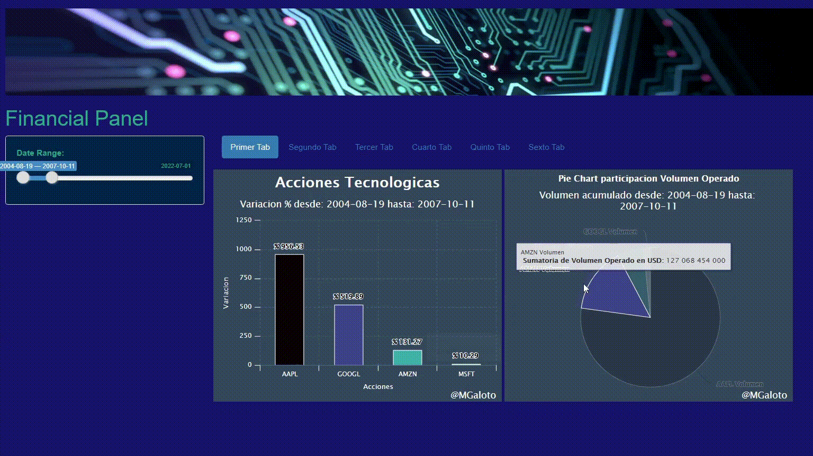

<div >

</div>


```{r setup, include=FALSE}
knitr::opts_chunk$set(echo = FALSE)
```


```{css my-header-colors, echo = FALSE}

.distill-site-nav {
    color: white;
    background-image: url('https://media4.giphy.com/media/jaOXKCxtBPLieRLI0c/giphy.gif?cid=790b76115d6cd90afde8787c5cdcafd67fc94960f3437562&rid=giphy.gif&ct=g');
    border: solid 1px black;
    border-radius: .3rem;
    font-size: 15px;
    font-weight: 300;
    background-size: cover;
    background-position: 100%;
}

h1{
    font-family: 'Alata', sans-serif;
    font-weight: 700;
}

p {
    font-family: 'Cardo', serif;
    font-weight: 200;
    line-height: 1.3;
    font-size: 1.075em;
    font-style: normal;
}

```


# Shiny


Shiny es un paquete R que facilita la creación de aplicaciones web interactivas directamente desde R. Puede alojar aplicaciones independientes en una página web o incrustarlas en documentos R Markdown o crear paneles . También puede ampliar sus aplicaciones Shiny con temas CSS , widgets html y acciones de JavaScript .


<p>
<a href="https://shiny.rstudio.com/" rel="nofollow"></a>
</p>


# Panel Financiero


Shiny App utilizando datos de Yahoo Finance para visualizar la variación porcentual y el volumen operado de 4 acciones del Nasdaq [Apple, Microsoft, Google, Amazon] dentro del periodo seleccionado. Los datos se registran desde 2004.


<ui>

<li>
Variación porcentual de 4 acciones del Nasdaq.
</li>

<li>
Volumen acumulado de operaciones dentro del periodo.
</li>


</ui>


# Gif

<p align="center">
  
</p>


# Incluye

<ui>

<li>
Extraccion, Transformacion y Carga.
</li>

<li>
Graficos Dinamicos y Estaticos.
</li>

<li>
Interactividad con Shiny.
</li>


</ui>


# Paquetes de R

<ui>

<li>
{tidyverse}
</li>

<li>
{highcharter}
</li>

<li>
{Shiny}
</li>

</ui>


# Datos

```{r, echo=TRUE, eval=FALSE}

# --------------------------------------------------------------------------------------- #

# Importar acciones

AAPL  = as.data.frame(getSymbols("AAPL"  , src = 'yahoo', auto.assign = F,
                                 from = "2004-08-19", to = Sys.Date(), periodicity = "daily"))

AMZN  = as.data.frame(getSymbols("AMZN"  , src = 'yahoo', auto.assign = F,
                                 from = "2004-08-19", to = Sys.Date(), periodicity = "daily"))

MSFT  = as.data.frame(getSymbols("MSFT"  , src = 'yahoo', auto.assign = F,
                                 from = "2004-08-19", to = Sys.Date(), periodicity = "daily"))

GOOGL = as.data.frame(getSymbols("GOOGL" , src = 'yahoo', auto.assign = F,
                                 from = "2004-08-19", to = Sys.Date(), periodicity = "daily"))


# --------------------------------------------------------------------------------------- #

```


