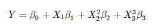
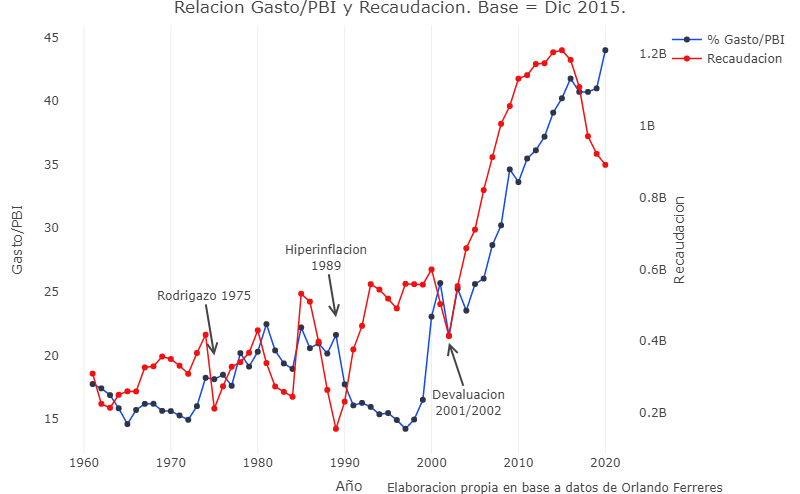
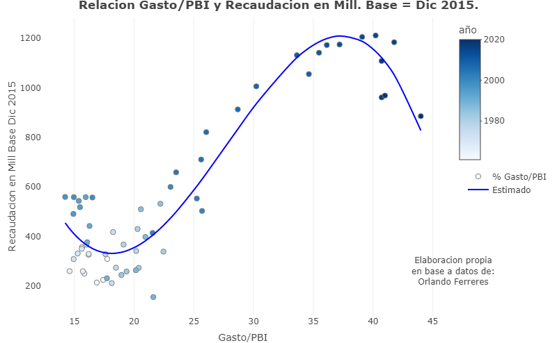

<div>

</div>

```{r setup, include=FALSE}
knitr::opts_chunk$set(echo = FALSE)
```


```{css my-header-colors, echo = FALSE}
.distill-site-nav {
    color: white;
    background-image: url('https://i.gifer.com/WGkW.gif');
    border: solid 1px black;
    border-radius: .3rem;
    font-size: 15px;
    font-weight: 300;
    background-size: cover;
    background-position: 100%;

}


```


## _Introducción:_


La curva de Laffer representa la relación existente entre los ingresos fiscales y las tasas impositivas, mostrando cómo varía la recaudación fiscal al modificar las tasas. 

Esta curva, difundida por el economista Arthur Laffer, plantea que subir la tasa del impuesto no necesariamente aumenta la recaudación, ya que la base tributaria tiende a disminuir. En el punto en el que la tasa impositiva es cero, los ingresos fiscales serán nulos, ya que no se aplica ningún impuesto. Mientras que, por el contrario, si la tasa impositiva es del 100%, los ingresos fiscales también serán nulos, ya que nadie aceptaría producir un bien cuyos ingresos generados fueran destinados en su totalidad, a pagar impuestos.


_Se utiliza uno de los algoritmos de IA para buscar máximos y mínimos locales de una función polinómica de tercer grado. El código toma datos macroeconómicos de Argentina desde 1961. La estimación busca encontrar la presión tributaria que hace máxima la recaudación en términos reales para los últimos 60 años en Argentina._


## _Hipótesis:_


A lo largo de los años de análisis existe un punto donde la presión tributaria hace que la recaudación en términos reales alcance un máximo. Es decir, a partir de ese punto, a mayor presión tributaria menor sera la recaudación en términos reales. 


## _Metodología:_

Para poder avanzar con la investigación se recolectan datos macroeconómicos anuales de ingresos corrientes, inflación y gasto público total sobre el PBI nominal. La variable ingresos corrientes fue transformada a valores reales tomando como año base el 2015. A partir de allí, se estimo un polinomio que mejor se ajusta a la relación entre las dos variables analizadas: recaudación en términos reales y presión tributaria. 

Cabe aclarar que se utilizo como presión tributaria el gasto público total sobre el PBI, ya que  que el mismo, en ciertos periodos, es independiente a la recaudación. Esto debido a que, el Estado, puede tomar deuda y/o financiarse vía Banco Central y al fin y al cabo, ese gasto público deberá ser financiado con mayores impuestos ya sean directos, indirectos o inflacionarios.


En otras palabras, el proceso llevao a cabo es el siguiente:   


* Recolección de datos Macroeconómicos.

* Transformación de variables a valores reales: Año Base: 2015.

* Se utilizara para la variable recaudación los ingresos corrientes ya que son los que mas están relacionados a la actividad económica, la presión tributaria sera el gasto total incluido nación, municipios y provincias sobre el PBI Nominal.

* Visualización y Análisis del comportamiento de las variables.

* Se estimara un polinomio que mejor ajuste a los datos.

* Elección y aplicación del algoritmo del método del gradiente para encontrar el máximo local donde la presión tributaria maximiza la recaudación en términos reales durante los últimos 60 años en Argentina.

**_Método del Gradiente:_**

Dada la naturaleza de la hipótesis que busca encontrar el punto máximo que existió en materia de recaudación en función de la presión impositiva exigida, se considera que el método de optimización que más se ajusta a la resolución de la problemática planteada, es el método de gradiente. 

El método del gradiente es un algoritmo de optimización iterativo para encontrar el mínimo o el máximo local de una función.

Para encontrar el mínimo local de una función usando el descenso de gradiente, debemos dar pasos proporcionales al negativo del gradiente de la función en el punto actual. 

Si damos pasos proporcionales al positivo del gradiente, nos acercaremos a un máximo local de la función, y el procedimiento se llama ascenso en gradiente.

El descenso de gradiente fue propuesto originalmente por Augustin Louis Cauchy en 1847. También se conoce como descenso más empinado.

Para entender la búsqueda local, encontraremos muy útil considerar la forma o el paisaje del espacio de estados. El paisaje tiene «posición» y «elevación». 

Si la elevación corresponde al costo, entonces el objetivo es encontrar el valle más bajo (un mínimo local); si la elevación corresponde a una función objetivo, entonces el objetivo es encontrar el pico más alto (un máximo local).

Los algoritmos de búsqueda local exploran este paisaje. Un algoritmo de búsqueda local completo siempre encuentra un objetivo si es que existe.

Se puede entrenar el algoritmo asignándole un valor inicial, una tasa de aprendizaje y un objetivo en donde debería dejar de iterar cuando encuentre el mínimo o máximo local. Dados los parámetros establecidos, cuando comienza la iteracion se llegara a un mínimo local si la derivada parcial de la variable dependiente respecto a la independiente es igual a cero y la segunda derivada parcial es positiva (mayor a cero). Se da lo contrario cuando alcanza un máximo local, es decir, la primera derivada tiene que ser igual a cero y la segunda derivada menor a 0.


En resumen:

*  El descenso de gradiente minimiza las funciones diferenciables que dan como resultado un número y tienen cualquier cantidad de variables de entrada.


En otras palabras, la fórmula indica dar un pequeño paso en la dirección del gradiente negativo.


*  El descenso de gradiente no puede determinar si un mínimo encontrado es local o global.

*  El coeficiente α  controla si el algoritmo converge a un mínimo rápida o lentamente, o si diverge.

*  Muchos problemas del mundo real se reducen al minimizar una función.


## _Desarrollo:_


Para el trabajo se utilizan los datos de Ingresos Corrientes de la administración publica nacional y el cociente entre gasto publico total (Nación, Provincias y Municipios) y producto bruto interno. La fuente es Orlando Ferreres - Dos Siglos de Economía Argentina, Fundación Norte y Sur.


 _Descripción de las variables del conjunto de datos:_ 


|$$ \textbf{Variable}$$ | $$ \textbf{Descripcion}$$ | 
|-------|------------|
| $$ año$$     |   $$Año$$         | 
| $$ inflacion$$     | $$Tasa  \: de\: Inflacion\: Anual  $$         |
| $$ recaudacion$$     | $$Ingresos \: Reales$$         | 
| $$ recaudacion\: en\: mill$$     | $$Ingresos \: Reales \: en \: Millones$$        | 
| $$ gastopbi$$     | $$Gasto  \: Publico \: Total \: / \: PBI\:Nominal$$            | 


_Administración Nacional:_ 


|$$ \textbf{Administracion Nacional. Agentes Recaudadores}$$ |  
|-------|
| $$   - Tesoro\: Nacional$$     | 
| $$ - Rec\: Afect $$     | 
| $$ - Organismos \:Desc$$     | 
| $$ - Inst \:de \:Seg \:Social$$     | 
| $$   - Ex\: Cajas \:Provinciales $$     | 


 _Componentes de Ingresos Corrientes:_ 


$$ \textbf{Ingresos Corrientes}$$ | 
--- | ---
$$   - Ingresos \:Tributarios$$   |         
$$ - Aportes \:y \:Contrib.\: a \:la \:Seg.\: Social $$     | 
$$ - Ingresos \: no \:Tributarios $$     |        
$$ - Vtas\: de\: Bs\: y\: Serv\: de\: la\: Adm \:Pub \:Nac $$     |   
$$   - Ingresos \:de\:Operacion $$     |                  
$$   - Rentas \:de\: la\: Propiedad\: Netas $$     |           
$$   - Transferencias\: Corrientes $$     |            
$$   - Otros\: Ingresos $$     |                     
$$   - Superavit\: Operativo\:  Emp \: Pub $$     | 


_Coeficientes del Polinomio estimado:_ 


```{r, echo=FALSE, out.width="25%", fig.cap="Relacion", fig.align="center"}

```

$$ \textbf{Coeficiente}$$ | $$ \textbf{Valor}$$ | 
-------|------------|
 $$Beta\:0$$   |   $$+4134$$         | 
 $$ Beta\:1$$     | $$-500.2 $$         |
 $$ Beta\:2$$     | $$+20.48$$         | 
 $$ Beta\:3$$     | $$-0.2459$$        | 


## _Algoritmo del Gradiente:_

En el software R mediante la librería Flexdashboard se desarrollo una puesta en escena del algoritmo calculado en Python. En el siguiente link podemos acceder a la visualización del polinomio estimado, los coeficientes, el algoritmo que interactua sobre el gráfico, el código de Python y los datos utilizados para el análisis. 
  
[https://rpubs.com/Algoritmo_Gradiente](https://rpubs.com/MGaloto/Argentina_Laffer) 


## _Relación entre variables:_


En el gráfico *Relación* podemos observar series temporales de la presión tributaria y la recaudación en términos reales. 

Cambien se señalaron las ultimas crisis de mayor magnitud para los años analizados. Se puede visualizar que la recaudación en términos reales en aquellas crisis ha sido muy baja producto de la caída de la actividad económica. 

En el ultimo año hay una gran diferencia entre las series temporales ya que la actividad económica ha sufrido una gran contracción respecto al 2019 producto del shock externo del Covid-19 y a la vez, el gasto publico se ha incrementado, principalmente financiado con emisión monetaria. 

```{r, echo=FALSE, out.width="85%", fig.cap="Relacion", fig.align="center"}

```


En el gráfico Estimado podemos ver la relación entre las variables de análisis. Los colores de cada punto hacen referencia al año del dato, claramente se ven menores valores de recaudación en términos reales y presión positiva en los primeros años. 

Le agregamos la curva estimada en Python que mejor ajusta a los datos, esta curva la estaremos utilizando para el método del gradiente y así encontrar el mínimo y el máximo local.


```{r, echo=FALSE, out.width="85%", fig.cap="Estimado", fig.align="center"}

```


## _Conclusiones:_


Tras analizar 60 años de historia económica nacional visto y considerando una tendencia creciente y sostenida en el tiempo sobre la presión tributaria  y también tomando en cuenta la presión tributaria de otros países de la región podemos concluir al menos 4 cosas:

*  La recaudación máxima en términos reales se alcanza cuando la presión tributaria es de aproximadamente 38% del PBI. Mientras que el mínimo de recaudación se encuentra cuando la presión tributaria es del 18%.

* De sostenerse esta tendencia la recaudación será cada vez menor ya que, el sector privado buscará eludir impuestos pudiendo llegar a resultados como ser la disminución en el nivel de producción.

* Dada la evidencia empírica podríamos concluir que los sectores que componen la economía (privados y públicos) necesitan llegar a un acuerdo sobre en qué partidas se puede trabajar para darle más oxígeno a la economía y que una reducción de la presión impositiva pueda a la vez incrementar los ingresos del sector público.

* Según la teoría de Laffer y su curva que relaciona las variables de análisis no se observa en nuestro trabajo un perfecto comportamiento de la misma ya que podemos ver un mínimo local, por lo tanto, concluimos que el comportamiento de las variables según Laffer se puede observar con una limitada similitud en nuestro trabajo de análisis para el caso Argentino que va desde 1961 a 2020.


_Se puede observar un mínimo local y un máximo local. Comparto el código y el dashboard final más abajo._


Codigo en: [Pagina de GitHub](https://github.com/MGaloto/descenso_gradiente)